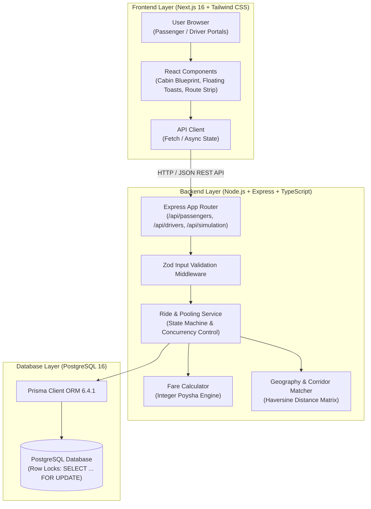
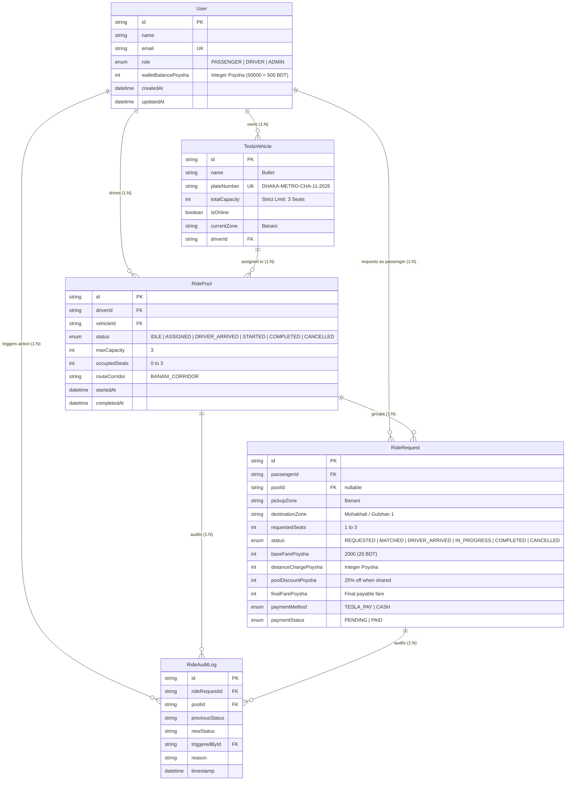
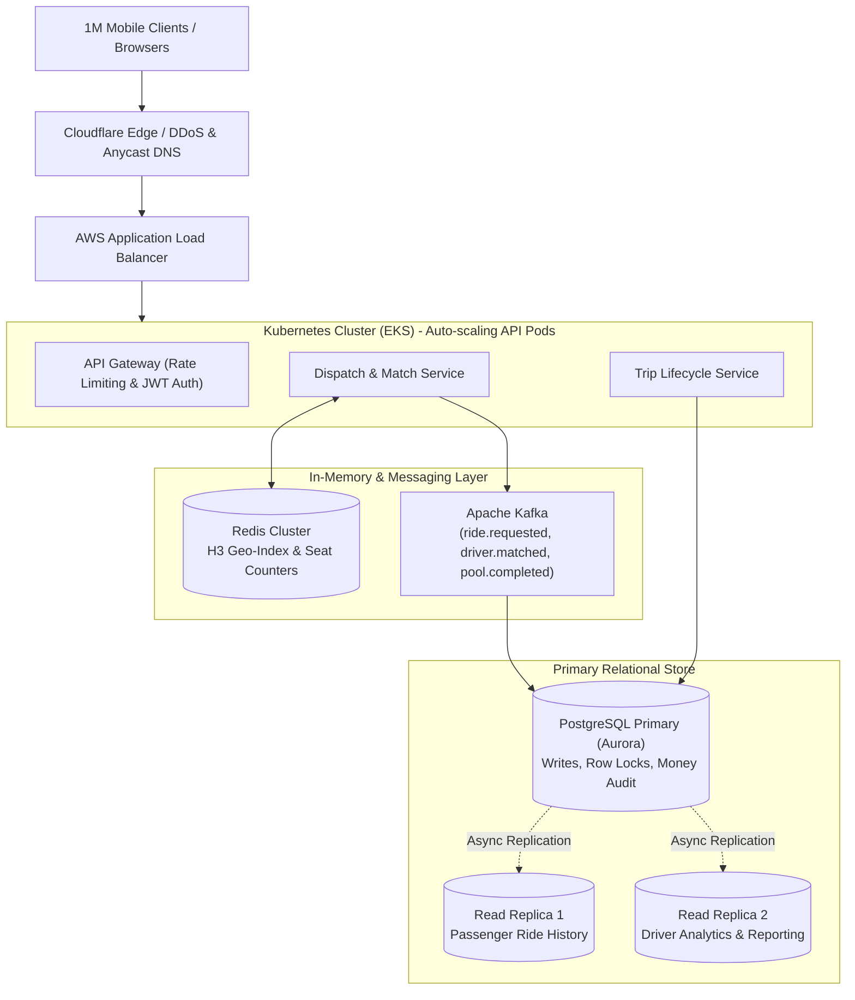

# ⚡ Dhaka Tesla Pool

> **"Share a seat. Split the fare. Survive Dhaka traffic."**  
> A production-grade ride-pooling MVP engineered for Dhaka’s battery-powered 3-wheeled electric "Teslas" (easybikes).

---

## 📋 Table of Contents
1. [The Banani Rush-Hour Story](#1-the-banani-rush-hour-story)
2. [Architecture Overview](#2-architecture-overview)
3. [Database Schema & ERD](#3-database-schema--erd)
4. [Technology Stack & Justification](#4-technology-stack--justification)
5. [Fare Model & Integer Poysha Storage](#5-fare-model--integer-poysha-storage)
6. [The Concurrency Problem (The 1-Seat Dilemma)](#6-the-concurrency-problem-the-1-seat-dilemma)
7. [Automated Testing Suite (Jest & Supertest)](#7-automated-testing-suite-jest--supertest)
8. [Local & Docker Deployment](#8-local--docker-deployment)
9. [API Overview](#9-api-overview)
10. [Bonus: "If Oi Tesla Goes Viral" (Scale to 1M Users)](#10-bonus-if-oi-tesla-goes-viral-scale-to-1m-users)
11. [AI Usage Policy Disclosure](#11-ai-usage-policy-disclosure)
12. [Six-Minute Demo Video Walkthrough Guide](#12-six-minute-demo-video-walkthrough-guide)

---

## 1. The Banani Rush-Hour Story

```
8:41 AM, Banani Road 11.
Jashim is leaning against Bullet, his three-seat, battery-powered, entirely unaffiliated “Tesla.”
Nusrat, already late, books a ride to Mohakhali.
Two minutes later, Rafiq books almost the same route to Gulshan 1.
The app matches them into Bullet, cuts their fares by 25%, and updates the driver's manifest.
Thirty seconds later, Shirin claims the final remaining seat.
When a fourth passenger attempts to book, Bullet is full — the app's concurrency locks prevent overbooking.
```

### Seed Data Cast:
- **Jashim** (`jashim@tesla.dhaka`): Driver of **Bullet** (Capacity: 3, Plate: `DHAKA-METRO-CHA-11-2026`).
- **Nusrat** (`nusrat@gmail.com`): Passenger 1 (Banani $\rightarrow$ Mohakhali, 1 seat).
- **Rafiq** (`rafiq@gmail.com`): Passenger 2 (Banani $\rightarrow$ Gulshan 1, 1 seat, shared corridor).
- **Shirin** (`shirin@gmail.com`): Passenger 3 (Banani $\rightarrow$ Gulshan 2, competing for the last seat).
- **Initial Wallet**: 500.00 BDT (50,000 Poysha) each.

---

## 2. Architecture Overview

Following the decoupled tier architecture (`Browser -> Next.js -> Node.js API -> PostgreSQL`):



---

## 3. Database Schema & ERD



---

## 4. Technology Stack & Justification

| Technology | Selection | Realistic Alternatives | Why Picked for this MVP | What Would Make Us Switch |
|---|---|---|---|---|
| **Frontend** | **Next.js 16 (App Router) + Tailwind CSS** | Plain React (Vite), Remix, Vue.js | Server-side rendering, zero-config routing, mobile-responsive Tailwind layout, single-page reactive dashboard. | If built as a pure native mobile app (React Native / Flutter). |
| **Backend** | **Node.js + Express + TypeScript** | Fastify, NestJS, Go (Gin) | Battle-tested, minimal overhead, straightforward middleware, fine-grained control over raw database locks. | If microservices / gRPC and strict enterprise dependency injection become necessary (NestJS or Go). |
| **Database** | **PostgreSQL 16** | MySQL, MongoDB, SQLite | True ACID transactions, robust row-level locking (`FOR UPDATE`), rich spatial indexing support (PostGIS). | MongoDB is disqualified due to weak cross-document multi-pool locking invariants. |
| **ORM** | **Prisma 6.4.1** | Drizzle ORM, TypeORM, Kysely | Declarative schema, automated migrations, type-safe query builder, built-in visual data explorer (Prisma Studio). | If extreme high-throughput queries require zero-overhead raw SQL query mapping (Drizzle / Kysely). |
| **Validation** | **Zod** | Joi, Yup, class-validator | TypeScript type inference from runtime schemas, strict runtime boundary validation. | N/A (industry gold standard). |
| **Testing** | **Jest + Supertest** | Vitest, Mocha/Chai | Full async support, integrated mocks, seamless HTTP integration testing without launching live network ports. | Vitest for native ESM performance in larger monorepos. |

---

## 5. Fare Model & Integer Poysha Storage

### Why Integer Poysha?
In financial computing, IEEE 754 floating-point decimals produce rounding errors (e.g. `0.1 + 0.2 = 0.30000000000000004`). In a ride-hailing system handling thousands of micro-transactions, fractional floating errors cause wallet balance leakage.  
**Solution**: All currency is stored as integer **Poysha** ($1\text{ BDT} = 100\text{ Poysha}$).

### Formula:
$$\text{passengerFare} = \text{baseFare} + \text{distanceCharge} - \text{poolDiscount}$$
- **Base Fare**: $2,000\text{ Poysha}$ ($20.00\text{ BDT}$)
- **Distance Rate**: $1,500\text{ Poysha / km}$ ($15.00\text{ BDT / km}$)
- **Shared Pool Discount**: $25\%$ off the subtotal ($0.25 \times (\text{baseFare} + \text{distanceCharge})$) whenever 2 or more passengers share Bullet.

### Hand-Calculable Proof (Nusrat & Rafiq):
- **Nusrat** (Banani $\rightarrow$ Mohakhali, $1.9\text{ km}$ via Haversine GPS):
  - Base: $2,000\text{ Poysha}$
  - Distance: $1.9 \times 1,500 = 2,850\text{ Poysha}$
  - Solo Total: $2,000 + 2,850 = \mathbf{4,850\text{ Poysha}}$ ($\mathbf{48.50\text{ BDT}}$)
  - Pooled Discount ($25\%$): $\text{round}(4,850 \times 0.25) = 1,213\text{ Poysha}$
  - Final Pooled Fare: $4,850 - 1,213 = \mathbf{3,637\text{ Poysha}}$ ($\mathbf{36.37\text{ BDT}}$)
- **Rafiq** (Banani $\rightarrow$ Gulshan 1, $2.1\text{ km}$ via Haversine GPS):
  - Solo Total: $2,000 + (2.1 \times 1,500) = \mathbf{5,150\text{ Poysha}}$ ($\mathbf{51.50\text{ BDT}}$)
  - Pooled Discount ($25\%$): $\text{round}(5,150 \times 0.25) = 1,288\text{ Poysha}$
  - Final Pooled Fare: $5,150 - 1,288 = \mathbf{3,862\text{ Poysha}}$ ($\mathbf{38.62\text{ BDT}}$)

---

## 6. The Concurrency Problem (The 1-Seat Dilemma)

### The Problem:
Bullet has 1 seat remaining. Nusrat and Shirin both click "Book" at the exact same millisecond. Both clients initially see 1 seat available. Without concurrency control, a naive `UPDATE` will increment occupancy to 4, exceeding Bullet's strict 3-seat capacity.

### How We Handle It Now (MVP):
We execute the matching logic inside a **PostgreSQL ACID transaction** using a **Pessimistic Row-Level Lock (`SELECT ... FOR UPDATE`)**:

```typescript
return await prisma.$transaction(async (tx) => {
  // 1. Lock the RidePool row against concurrent reads/writes
  const [lockedPool] = await tx.$queryRaw<Array<{ occupiedSeats: number; maxCapacity: number }>>`
    SELECT "occupiedSeats", "maxCapacity" 
    FROM "RidePool" 
    WHERE id = ${pool.id} 
    FOR UPDATE
  `;

  // 2. Strict capacity check on locked row
  if (lockedPool.occupiedSeats + request.requestedSeats > lockedPool.maxCapacity) {
    throw new ConcurrencyConflictError(
      `Cannot book seat. Only ${lockedPool.maxCapacity - lockedPool.occupiedSeats} seat(s) available in Bullet.`
    );
  }

  // 3. Atomically update seats and commit
  await tx.ridePool.update({
    where: { id: pool.id },
    data: { occupiedSeats: lockedPool.occupiedSeats + request.requestedSeats }
  });
});
```
- **Outcome**: The first transaction acquires the lock and books the seat. The second transaction waits for the lock, reads the updated `occupiedSeats: 3`, fails the condition, and is rejected with a `409 Conflict: ConcurrencyConflictError`. Bullet is never overbooked.

### What We'd Change at Larger Scale (100k Drivers):
Row locks create database lock contention at scale. In production:
1. **Redis Atomic Decrement (`DECRBY`)**: Use an in-memory Redis key `pool:{id}:available_seats` with Lua scripts for microsecond atomic reservation before touching Postgres.
2. **Distributed Locks (Redlock)**: Partitioned seat reservation tokens with TTL expiration.
3. **Optimistic Locking with Versioning**: `UPDATE "RidePool" SET version = version + 1 WHERE id = $id AND version = $expectedVersion`.

---

## 7. Automated Testing Suite (Jest & Supertest)

All 6 critical domain invariants mandated by Section 12 are verified with automated tests:

```bash
cd server
npm test
```

### Test Results:
```
PASS src/__tests__/ride-pooling.test.ts
  Dhaka Tesla Pool - Core Engineering Requirements
    √ 1. Nusrat and Rafiq pooled fares calculate accurately with integer Poysha and 25% discount (43 ms)
    √ 2. Bullet capacity (3 seats) can NEVER be exceeded (281 ms)
    √ 3. Concurrency Safety: Simultaneous bookings for the last seat cannot corrupt capacity (250 ms)
    √ 4. Invalid state transitions are strictly rejected by the state machine (106 ms)
    √ 5. Cancellation rules hold: allowed while MATCHED, rejected once trip is STARTED (160 ms)
    √ 6. User cannot cancel or tamper with another passenger’s ride (136 ms)

Test Suites: 1 passed, 1 total
Tests:       6 passed, 6 total
Snapshots:   0 total
```

---

## 8. Local & Docker Deployment

### Prerequisites:
- **Node.js 20+**
- **Docker Desktop**

---

### Option A: 1-Command Docker Compose (Evaluator Standard)
In the project root folder:
```bash
docker compose up --build
```
- Starts `postgres` container on port `5432` with automated health checks.
- Runs database migrations (`prisma db push`) and seeds the story cast (`prisma db seed`).
- Starts the Express API on `http://localhost:5000`.
- Starts the Next.js frontend on `http://localhost:3000`.

---

### Option B: Local Development Mode
1. **Start PostgreSQL in Docker**:
   ```bash
   docker run -d --name dhaka_tesla_postgres -p 5432:5432 -e POSTGRES_USER=postgres -e POSTGRES_PASSWORD=postgres -e POSTGRES_DB=dhaka_tesla_pool postgres:16-alpine
   ```
2. **Setup Server**:
   ```bash
   cd server
   cp .env.example .env
   npm install
   npx prisma db push
   npx prisma db seed
   npm run dev
   ```
3. **Setup Client**:
   ```bash
   cd client
   npm install
   npm run dev
   ```
4. Open `http://localhost:3000`.

---

## 9. API Overview

| Method | Endpoint | Description |
|---|---|---|
| `GET` | `/health` | Docker & deployment health check probe |
| `GET` | `/api/passengers` | List seeded passengers (Nusrat, Rafiq, Shirin) |
| `GET` | `/api/passengers/estimate` | Estimate solo vs pooled fare before booking |
| `POST` | `/api/passengers/requests` | Request a ride (pickup, destination, seats) |
| `GET` | `/api/passengers/requests/:requestId` | Get single ride status & individual fare |
| `POST` | `/api/passengers/requests/:requestId/cancel`| Cancel ride (allowed before trip is started) |
| `GET` | `/api/passengers/:passengerId/history` | Passenger ride history & audit trail |
| `GET` | `/api/drivers` | List drivers (Jashim) and registered Teslas |
| `GET` | `/api/drivers/:driverId/dashboard` | Bullet capacity, onboard passengers, active pool |
| `GET` | `/api/drivers/requests/available` | Incoming ride requests matching corridor |
| `POST` | `/api/drivers/pools/match` | Accept passenger into Bullet (concurrency locked) |
| `POST` | `/api/drivers/pools/:poolId/status` | Advance trip lifecycle (`DRIVER_ARRIVED` $\rightarrow$ `STARTED` $\rightarrow$ `COMPLETED`) |
| `POST` | `/api/simulation/banani-rush-hour` | 1-Click end-to-end execution of Banani Rush-Hour story |

---

## 10. Bonus: "If Oi Tesla Goes Viral" (Scale to 1M Users)

If *Dhaka Tesla Pool* scales to **1,000,000 passengers** and **100,000 electric Teslas across Dhaka**:



### Key Scaling Strategies:
1. **Geospatial Indexing with Uber H3 / PostGIS**:
   - Divide Dhaka into hexagonal spatial cells (H3 resolution 8, ~460m radius).
   - Match incoming requests to nearby Teslas in memory within $O(1)$ time rather than table scanning.
2. **Event-Driven Architecture (Kafka / RabbitMQ)**:
   - Decouple matching from database persistence. A passenger ride request is published to `ride.requested`.
   - Matching workers process corridor matching asynchronously and stream notifications via **WebSockets**.
3. **Idempotency Keys**:
   - All booking and payment requests require a client-generated UUID `Idempotency-Key` header stored in Redis with a 5-minute TTL to prevent double booking on shaky mobile data connections.
4. **Database Sharding & Read Replicas**:
   - Write transactions isolated to AWS Aurora PostgreSQL Primary; all passenger history and analytics read from auto-scaled read replicas.
   - Partition ride history tables by month (`ride_requests_2026_09`).

---

## 11. AI Usage Policy Disclosure

In compliance with Section 8 of the challenge brief:

- **AI Tools Used**: Cursor / Antigravity AI Assistant.
- **What AI was used for**: Generating boilerplate schema definitions, drafting initial TypeScript service interfaces, and validating Haversine distance mathematics.
- **One Accepted Suggestion**:
  - *Suggestion*: Storing all money in integer **Poysha** rather than decimals to eliminate floating-point rounding errors and ensure hand-calculable testing.
- **One Rejected / Modified Suggestion**:
  - *Original AI Suggestion*: Using an in-memory Mutex lock in Node.js memory (`async-mutex`) for seat booking.
  - *Why Rejected/Changed*: An in-memory mutex only works in a single Node process. If deployed behind a load balancer with 2 or more API instances, the in-memory lock fails completely and allows overbooking. We replaced it with **PostgreSQL database-level row locking (`SELECT ... FOR UPDATE`)**, which guarantees data integrity across any number of clustered backend instances.

---

## 12. Six-Minute Demo Video Walkthrough Guide

Use this structured script for your Loom demo recording (maximum 6 minutes):

| Timestamp | Section | Talking Points & What to Show on Screen |
|---|---|---|
| **0:00 - 1:00** | **Problem & Cast** | • Introduce yourself and *Dhaka Tesla Pool*.<br>• Introduce the Banani Rush-Hour story: Jashim (driver of 3-seat Bullet), Nusrat, Rafiq, Shirin.<br>• Explain the goal: Solve Dhaka traffic by pooling shared electric easybikes with fair transparent fares. |
| **1:00 - 2:45** | **Architecture & Decisions** | • Show the **Architecture Diagram** and **ERD**.<br>• Explain the **Integer Poysha currency model** (no float errors).<br>• Show `ride.service.ts` and explain **how you solved the 1-seat concurrency dilemma** using PostgreSQL row-level locks (`FOR UPDATE`). |
| **2:45 - 4:45** | **Product Tour (Live Demo)** | • Open `http://localhost:3000`.<br>• **Passenger Flow**: Show Nusrat booking Banani $\rightarrow$ Mohakhali ($48.50$ BDT solo).<br>• **Driver Flow**: Show Jashim's Bullet cabin diagram lighting up with Seat 1 occupied ($1/3$).<br>• **Pooling Magic**: Show Rafiq booking Banani $\rightarrow$ Gulshan 1. Jashim accepts $\rightarrow$ watch both fares drop by $25\%$ ($36.37$ BDT)!<br>• **Capacity Test**: Shirin books the final seat ($3/3$). Show the 4th booking attempt getting blocked by overcapacity protection. |
| **4:45 - 5:30** | **Automated Tests & Docker** | • Switch to terminal and run `npm test` in `server/`.<br>• Show all 6 tests passing (concurrency, capacity, state machine, fare calculation).<br>• Mention `docker compose up --build` runs everything in 1 command. |
| **5:30 - 6:00** | **Conclusion & Viral Scale** | • Highlight the "If Oi Tesla Goes Viral" scaling section (H3 spatial indexing, Kafka, Redis).<br>• Wrap up confidently. |

---

## 👨‍💻 Git Engineering History
The repository follows a clean, branch-per-feature Git workflow:
- `master` $\rightarrow$ Production-ready integration
- `pre-release` $\rightarrow$ Integration verification & documentation freeze
- `release/v1.0.0` $\rightarrow$ Final release deliverable
- Feature branches: `feature/project-scaffolding`, `feature/database-and-schema`, `feature/pooling-and-ride-engine`, `feature/automated-test-suite`, `feature/frontend-nextjs-ui`, `feature/docker-and-deployment`, `feature/documentation-and-readme`.
