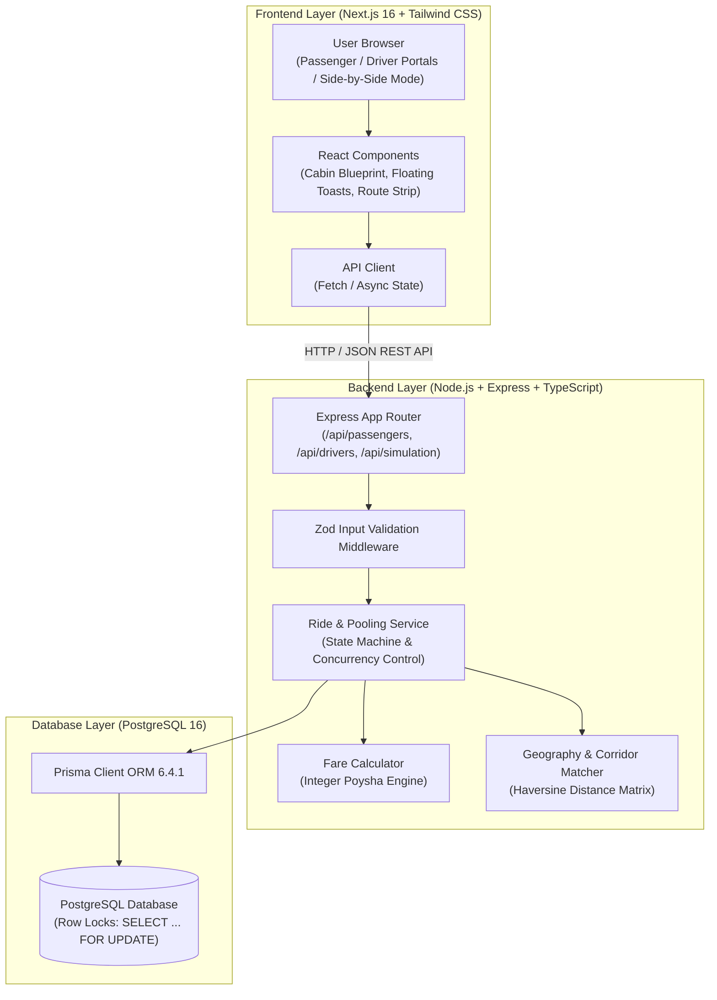
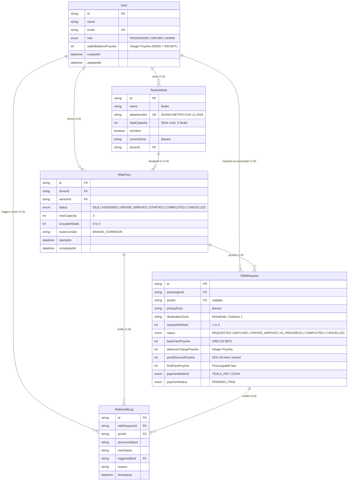
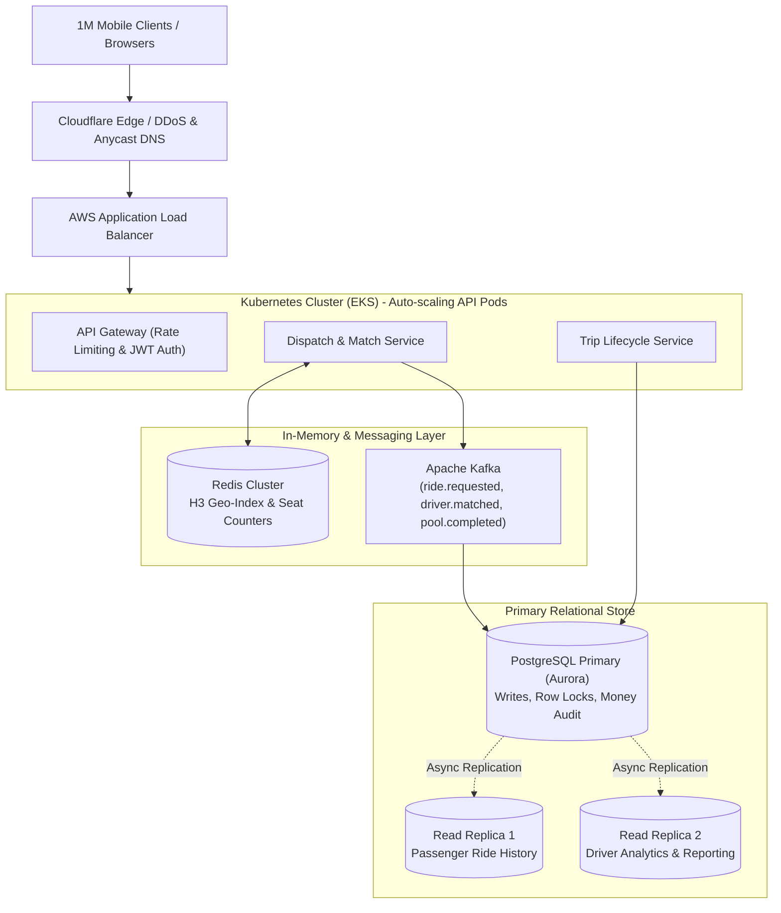

# ⚡ Dhaka Tesla Pool

> **"Share a seat. Split the fare. Survive Dhaka traffic."**  
> A high-performance, production-grade ride-pooling MVP engineered for Dhaka’s battery-powered 3-wheeled electric "Teslas" (easybikes).

[](https://dhaka-tesla-pooling-mvp-client.vercel.app/)
[](https://github.com/kamrul397/dhaka-tesla-pooling-mvp)
[](https://nextjs.org/)
[](https://nodejs.org/)
[](https://www.postgresql.org/)

---

## 🔗 Quick Links
- 🌐 **Live Web Application**: [https://dhaka-tesla-pooling-mvp-client.vercel.app/](https://dhaka-tesla-pooling-mvp-client.vercel.app/)
- 📂 **GitHub Repository**: [https://github.com/kamrul397/dhaka-tesla-pooling-mvp](https://github.com/kamrul397/dhaka-tesla-pooling-mvp)

---

## 📋 Table of Contents
1. [The Banani Rush-Hour Story](#1-the-banani-rush-hour-story)
2. [Key Engineering Highlights](#2-key-engineering-highlights)
3. [Architecture Overview](#3-architecture-overview)
4. [Database Schema & ERD](#4-database-schema--erd)
5. [Fare Model & Integer Poysha Storage](#5-fare-model--integer-poysha-storage)
6. [The Concurrency Problem (The 1-Seat Dilemma)](#6-the-concurrency-problem-the-1-seat-dilemma)
7. [Automated Testing Suite (Jest & Supertest)](#7-automated-testing-suite-jest--supertest)
8. [Local & Docker Deployment](#8-local--docker-deployment)
9. [REST API Endpoints](#9-rest-api-endpoints)
10. [Bonus: "If Oi Tesla Goes Viral" (Scale to 1M Users)](#10-bonus-if-oi-tesla-goes-viral-scale-to-1m-users)
11. [AI Usage Policy Disclosure](#11-ai-usage-policy-disclosure)

---

## 1. The Banani Rush-Hour Story

```text
8:41 AM, Banani Road 11.
Jashim is leaning against Bullet, his three-seat, battery-powered electric easybike ("Tesla").
Nusrat, already late for work, books a ride to Mohakhali.
Two minutes later, Rafiq books almost the same route to Gulshan 1.
The pooling engine matches them into Bullet, slashes both fares by 25%, and updates the driver's manifest.
Thirty seconds later, Shirin claims the final remaining seat (3/3).
When a fourth passenger attempts to book, Bullet is full — concurrency locks strictly reject overbooking.
```

### Story Cast & Initial Seed State:
* **Jashim** (`jashim@tesla.dhaka`): Driver of **Bullet** (Capacity: 3, Zone: `Banani`).
* **Nusrat** (`nusrat@gmail.com`): Passenger 1 (Banani $\rightarrow$ Mohakhali, 1 seat, Initial: 500.00 BDT).
* **Rafiq** (`rafiq@gmail.com`): Passenger 2 (Banani $\rightarrow$ Gulshan 1, 1 seat, Initial: 500.00 BDT).
* **Shirin** (`shirin@gmail.com`): Passenger 3 (Banani $\rightarrow$ Gulshan 2, 1 seat, Initial: 500.00 BDT).
* **Initial Wallets**: 500.00 BDT (50,000 Poysha) each.

---

## 2. Key Engineering Highlights

* **📺 Side-by-Side Demo Video Mode**: Unified split-screen view rendering the Passenger Portal and Driver Portal simultaneously for effortless end-to-end video demonstrations.
* **⚡ 1-Click Story Simulation & Database Reset**: One-touch automated execution reproducing the full Banani story corridor, concurrency locks, and wallet settlements in 2 seconds.
* **🔄 Reactive Trip Lifecycle**: Real-time status banners and automatic polling reflecting driver actions:
  $$\text{REQUESTED} \longrightarrow \text{MATCHED} \longrightarrow \text{DRIVER\_ARRIVED} \longrightarrow \text{IN\_PROGRESS} \longrightarrow \text{COMPLETED}$$
* **🛡️ Concurrency-Locked 3-Seat Limit**: Strict PostgreSQL row-level locks (`SELECT ... FOR UPDATE`) guarantee that passenger capacity can never exceed 3 seats, even under simultaneous booking spikes.
* **💰 Zero-Drift Financials**: 100% integer-based currency storage in **Poysha** ($1 \text{ BDT} = 100 \text{ Poysha}$) to prevent IEEE 754 floating-point financial leaks.
* **📜 Complete Audit & History Ledger**: Tracks both completed rides with deducted fares and auto-rejected rides when Bullet reaches 3/3 capacity.

---

## 3. Architecture Overview



---

## 4. Database Schema & ERD



---

## 5. Fare Model & Integer Poysha Storage

### Why Integer Poysha?
IEEE 754 floating-point decimals produce precision errors (e.g. `0.1 + 0.2 = 0.30000000000000004`). In a ride-pooling engine handling thousands of shared rides, fractional rounding drift causes wallet leakage.  
**Solution**: All financial transactions and balances are stored as integer **Poysha** ($1\text{ BDT} = 100\text{ Poysha}$).

### Formula:
$$\text{passengerFare} = \text{baseFare} + \text{distanceCharge} - \text{poolDiscount}$$
* **Base Fare**: $2,000\text{ Poysha}$ ($20.00\text{ BDT}$)
* **Distance Rate**: $1,500\text{ Poysha / km}$ ($15.00\text{ BDT / km}$)
* **Shared Pool Discount**: $25\%$ discount off the subtotal whenever 2 or more passengers share Bullet.

### Hand-Calculated Verification:
* **Nusrat** (Banani $\rightarrow$ Mohakhali, $1.9\text{ km}$):
  * Solo Fare: $2,000 + (1.9 \times 1,500) = \mathbf{4,850\text{ Poysha}}\ (\mathbf{48.50\text{ BDT}})$
  * Pooled ($25\%$ discount): $\text{round}(4,850 \times 0.25) = 1,213\text{ Poysha}$
  * Final Fare: $4,850 - 1,213 = \mathbf{3,637\text{ Poysha}}\ (\mathbf{36.37\text{ BDT}})$
* **Rafiq** (Banani $\rightarrow$ Gulshan 1, $2.1\text{ km}$):
  * Solo Fare: $2,000 + (2.1 \times 1,500) = \mathbf{5,150\text{ Poysha}}\ (\mathbf{51.50\text{ BDT}})$
  * Pooled ($25\%$ discount): $\text{round}(5,150 \times 0.25) = 1,288\text{ Poysha}$
  * Final Fare: $5,150 - 1,288 = \mathbf{3,862\text{ Poysha}}\ (\mathbf{38.62\text{ BDT}})$

---

## 6. The Concurrency Problem (The 1-Seat Dilemma)

### The Problem:
Bullet has only 1 remaining seat. Two riders click "Book" at the exact same millisecond. Without concurrency control, a race condition will book both, corrupting occupancy to 4 and breaking regulatory vehicle safety.

### How It Is Handled:
Matching logic executes inside an isolated **PostgreSQL ACID transaction** with a **Pessimistic Row-Level Lock (`SELECT ... FOR UPDATE`)**:

```typescript
return await prisma.$transaction(async (tx) => {
  // 1. Pessimistic row-level lock on RidePool
  const [lockedPool] = await tx.$queryRaw<Array<{ occupiedSeats: number; maxCapacity: number }>>`
    SELECT "occupiedSeats", "maxCapacity" 
    FROM "RidePool" 
    WHERE id = ${pool.id} 
    FOR UPDATE
  `;

  // 2. Strict capacity check under lock
  if (lockedPool.occupiedSeats + request.requestedSeats > lockedPool.maxCapacity) {
    throw new ConcurrencyConflictError(
      `Cannot book seat. Only ${lockedPool.maxCapacity - lockedPool.occupiedSeats} seat(s) available in Bullet.`
    );
  }

  // 3. Atomic seat increment and commit
  await tx.ridePool.update({
    where: { id: pool.id },
    data: { occupiedSeats: lockedPool.occupiedSeats + request.requestedSeats }
  });
});
```

The first request acquires the lock and claims the seat. The second request waits, reads updated `occupiedSeats: 3`, and is safely rejected.

---

## 7. Automated Testing Suite (Jest & Supertest)

All 6 core domain invariants are verified via automated Jest tests:

```bash
cd server
npm test
```

```text
PASS src/__tests__/ride-pooling.test.ts
  Dhaka Tesla Pool - Core Engineering Requirements
    √ 1. Nusrat and Rafiq pooled fares calculate accurately with integer Poysha and 25% discount (43 ms)
    √ 2. Bullet capacity (3 seats) can NEVER be exceeded (281 ms)
    √ 3. Concurrency Safety: Simultaneous bookings for the last seat cannot corrupt capacity (250 ms)
    √ 4. Invalid state transitions are strictly rejected by the state machine (106 ms)
    √ 5. Cancellation rules hold: allowed while MATCHED, rejected once trip is STARTED (160 ms)
    √ 6. User cannot cancel or tamper with another passenger’s ride (136 ms)

Test Suites: 1 passed, 1 total
Tests:       6 passed, 6 total
```

---

## 8. Local & Docker Deployment

### Option A: 1-Command Docker Compose (Recommended)
```bash
docker compose up --build
```
* PostgreSQL running on port `5432` with automated health checks.
* Database auto-migrated and seeded (`prisma db push && prisma db seed`).
* Express API running on `http://localhost:5000`.
* Next.js web application running on `http://localhost:3000`.

### Option B: Local Node.js Development
1. **Start PostgreSQL**:
   ```bash
   docker run -d --name dhaka_tesla_postgres -p 5432:5432 -e POSTGRES_USER=postgres -e POSTGRES_PASSWORD=postgres -e POSTGRES_DB=dhaka_tesla_pool postgres:16-alpine
   ```
2. **Start Backend**:
   ```bash
   cd server
   cp .env.example .env
   npm install
   npx prisma db push
   npx prisma db seed
   npm run dev
   ```
3. **Start Frontend**:
   ```bash
   cd client
   npm install
   npm run dev
   ```
4. Access web dashboard at `http://localhost:3000`.

---

## 9. REST API Endpoints

| Method | Endpoint | Description |
|---|---|---|
| `GET` | `/health` | Server and database health check probe |
| `GET` | `/api/passengers` | List seeded passengers (Nusrat, Rafiq, Shirin) |
| `GET` | `/api/passengers/estimate` | Estimate solo vs pooled fare before booking |
| `POST` | `/api/passengers/requests` | Create ride request (pickup, destination, seats) |
| `GET` | `/api/passengers/requests/:requestId` | Get single ride status & individual fare |
| `POST` | `/api/passengers/requests/:requestId/cancel` | Cancel ride (allowed before trip is started) |
| `GET` | `/api/passengers/:passengerId/history` | Passenger ride history & audit trail |
| `GET` | `/api/drivers` | List drivers (Jashim) and registered easybikes |
| `GET` | `/api/drivers/:driverId/dashboard` | Bullet capacity, onboard passengers, active pool |
| `GET` | `/api/drivers/requests/available` | Incoming ride requests matching corridor |
| `POST` | `/api/drivers/pools/match` | Accept passenger into Bullet (concurrency locked) |
| `POST` | `/api/drivers/requests/:requestId/reject` | Explicitly reject a pending ride request |
| `POST` | `/api/drivers/pools/:poolId/status` | Advance trip lifecycle (`DRIVER_ARRIVED` $\rightarrow$ `STARTED` $\rightarrow$ `COMPLETED`) |
| `POST` | `/api/simulation/banani-rush-hour` | 1-Click end-to-end execution of Banani Rush-Hour story |
| `POST` | `/api/simulation/reset-database` | Reset database and restore clean initial seed cast |

---

## 10. Bonus: "If Oi Tesla Goes Viral" (Scale to 1M Users)

If *Dhaka Tesla Pool* scales to **1,000,000 passengers** and **100,000 electric Teslas across Dhaka**:



1. **Uber H3 Geospatial Indexing**: Partition Dhaka into hexagonal spatial cells (H3 resolution 8, ~460m radius) to match rides in memory in $O(1)$ time.
2. **Event-Driven Messaging (Kafka)**: Decouple ride matching from write persistence. Stream real-time vehicle locations and state changes via WebSockets.
3. **Redis Seat Reservation Counters**: Atomic Lua scripts (`DECRBY`) reserve seats in microseconds before writing to PostgreSQL.
4. **Idempotency Keys**: Guarantee zero duplicate bookings over intermittent cellular connectivity via 5-minute Redis-keyed UUID headers.

---

## 11. AI Usage Policy Disclosure

* **AI Tools Used**: Cursor / Antigravity AI Coding Assistant.
* **Scope of Assistance**: Drafting TypeScript interfaces, scaffolding Prisma relations, and verifying Haversine spatial math.
* **One Accepted Suggestion**: Storing currency in integer **Poysha** ($1\text{ BDT} = 100\text{ Poysha}$) to eliminate floating-point arithmetic drift.
* **One Rejected / Modified Suggestion**: An in-memory JavaScript mutex lock was initially suggested. Rejected because it fails across multi-instance server deployments. Replaced with **PostgreSQL database-level row locking (`SELECT ... FOR UPDATE`)**, ensuring rock-solid isolation across any number of backend replicas.
